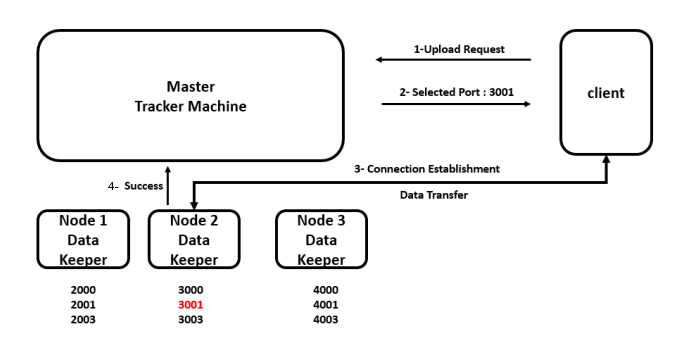

# TYDFS
Distributed file system using python &amp; ZMQ for communication between processes.  
The platform allows the user to upload files and download them from multiple machines.  
There are two different types of machines:
1. Master
2. Datakeeper

## Master Machine
It's the interface between the client and the datakeepers,  
it handles the communication between datakeepers themselves 
and between the client and the datakeepers.  
It's responsible for keeping track of which datakeepers are alive and which are busy,  
it also keeps track of where the files uploaded by clients.  
It's responsible also for making sure that the files are replicated at least 3 times  
between datakeepers to increase the availability of the data.  
The master machine contains 3 different types of processes that runs in parallel:  
1. Server Process
2. Alive Process
3. Replica Process

### Server Process
There are several processes of this type in the master.  
It's the main one, and it's responsible for receiving requests from the client 
and sending requests to datakeepers.  
There are 2 different types of messages that are received from the client:
1. Upload Request
2. Download Request
   
It's also resbosible for receiving success messages from Datakeepers 
and making them available again.  
The Server Process is always listening to requests from the client 
and success messages from the datakeepers.  
The used communication model between master and clients is Server/Client.  
The used communication model between master and Datakeepers is Client/Server  
(The Master is the client and the datakeeper is the server).  
The used communication model between master and Datakeepers for success messages is PUSH/PULL  
(every server process in the master is connected to all the datakeepers, 
and the datakeepers bind the socket).

### Alive Process
It's responsible for receiveing alive (heartbeats) signals from datakeepers
to keep track of the alive processes.  
The used commucation model is Publisher/Subscriber, the datakeepers are publishers and the master is the subscriber.

### Replica Process
It's responsible for ensuring that every file is replicated at least 3 times between datakeepers.  
It uses the same communication model between the server process in the master and the datakeepers.

## Datakeeper Machine
It's where the actual data is found.  
It receives the requests from the master.  
There are 2 different types of processes that run in parallel:
1. Server Process
2. Alive Process  

The alive process sends heartbeats signals to the master to indicate that the data keeper is alive.  
The server process is the main one that receives requests from the master.  
There are several processes of server type in the datakeepers that run in parallel.  
There are 3 different types of requests that are received from the master:  
1. Download Request (The Client needs to download a file).
2. Replica source (The master tell the datakeeper to send a file to another datakeeper)
3. Replica destination (The master tell the datakeeper to receive a file from another datakeeper)
   
The communication model between a datakeeper and another is Server/Client  
(The receiver datakeeper requests the file from the sender datakeeper).  
The communication model between datakeepers and clients in downloading and uploading is PUSH/PULL.  

The datakeeper is always listening to requests from master,  
and to a connection from anyone that wants to upload a file, see [Upload Scenario](#upload-scenario). 

## Client
It makes 2 types of requests:
1. Upload File
2. Download File

## Upload Scenario
1. A client process send upload request to the master machine.
2. The master choose a free datakeeper process and responds with the port number of it.
3. The client then establish connection with this port, and transfers the file to it.
4. When the transferring is finished, The datakeeper sends success message to the master
5. When the master receives the success message, it update that the datakeeper is free,  
   and it adds the file record and update which datakeeper has the file.

## Download Scenario
1. Client sends download request with a certain file name to the Master.
2. The master choose free datakeeper processes 
   and responds with list of machines IPs and ports to download the file from.
3. Client process establish connection with these ports and download the file from them.
4. When the transferring is finished, The datakeeper sends success message to the master
5. When the master receives the success message, it update that the datakeeper is free
   

## Running the system
The following modules need to run in parallel.  
Run `Client.py` any number of time and pass integer id as an argument.

Run `Datakeeper.py` 3 times and give it id form 0 to 2.

If you want to extend number of data keeper nodes you should change `Conf.py` `DATA_KEEPER_IPs` section,  
then you can run `DataKeeper.py` as much as you want.

Run `Master.py` once.

The master and the datakeepers are multi-process modules with three processes if you want to change it,  
change the Ports in `Conf.py` so it can suit the number of process.

